# 🚀 Incubyte Assessment – String Calculator (TDD)

A professional implementation of the **String Calculator Kata**, built using **JavaScript** with **Test-Driven Development** (TDD) and **Jest**. Visual testing evidence is included via pass/fail screenshots for every test case.

---

## 📚 Table of Contents

- [📖 Overview](#-overview)
- [🧩 Problem Statement](#-problem-statement)
- [🗂 Project Structure](#-project-structure)
- [⚙️ Setup & Installation](#️-setup--installation)
- [📦 Usage](#-usage)
- [🧪 Testing](#-testing)
- [🖼️ Screenshots](#-screenshots)
- [📈 Commit History](#-commit-history)
- [🛠️ Tech Stack](#️-tech-stack)

---

## 📖 Overview

This project solves the Incubyte String Calculator Kata using **clean code principles** and a **test-first approach**. Every feature was developed using **incremental TDD**. Screenshots document both passing and failing test states.

---

## 🧩 Problem Statement

Implement a `StringCalculator` class with the method:
```js
add(numbers) // numbers: string, returns number
```

The method must:

- ✅ Return `0` for an empty string  
- ✅ Sum numbers separated by commas  
- ✅ Handle `\n` as a valid delimiter  
- ✅ Support custom delimiters (e.g. `//[;]\n1;2`)  
- ✅ Throw exception for negative numbers (listing all negatives)  
- ✅ Ignore numbers > 1000  
- ✅ Allow multiple custom delimiters, including multi-character  

**Examples:**

```txt
"" => 0  
"1,2" => 3  
"1\n2,3" => 6  
"//;\n2;5" => 7  
"//[***]\n1***2***3" => 6  
"//[*][%]\n1*2%3" => 6  
```

---

## 🗂 Project Structure

```
incubyte/
├── src/
│   └── StringCalculator.js         # Core implementation
│
├── tests/
│   └── StringCalculator.test.js    # Jest test suite
│
├── screenshots/                    # Test result screenshots
│   ├── pass_*.png                  # Passing case visuals
│   ├── fail_*.png                  # Failing case visuals
│
├── .gitignore                      # Ignored files
├── package.json                    # Project metadata & scripts
├── package-lock.json               # Lock file
└── README.md                       # This file
```

---

## ⚙️ Setup & Installation

### 1️⃣ Clone the Repository

```bash
git clone https://github.com/jaymehta2189/Incubyte_assessment.git
cd Incubyte_assessment
```

### 2️⃣ Install Dependencies

```bash
npm install
```

---

## 📦 Usage

You can use the calculator programmatically like this:

```js
const StringCalculator = require('./src/StringCalculator');
const calc = new StringCalculator();

console.log(calc.add("1,2,3"));         // Output: 6
console.log(calc.add("//[**]\n2**3"));  // Output: 5
console.log(calc.getCalledCount());     // Output: 2
```

---

## 🧪 Testing

All tests are written in Jest and cover:

- ✅ Basic sums  
- ✅ Newline delimiters  
- ✅ Custom/multiple delimiters  
- ✅ Negative number handling  
- ✅ Ignoring numbers > 1000  
- ✅ Call count  

### 🔍 Run all tests:

```bash
npm test
```

Tests are located in `tests/StringCalculator.test.js`.

---

## 🖼️ Screenshots

| ✅ Pass Cases                            | ❌ Fail Cases                             |
|-----------------------------------------|-------------------------------------------|
| 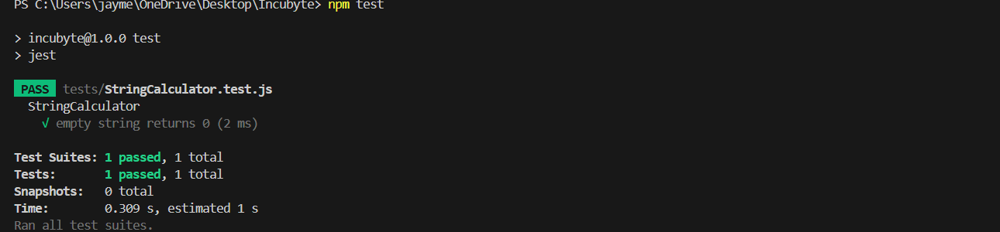       | 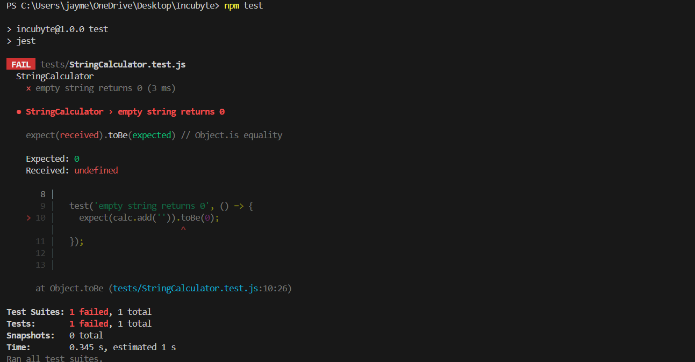       |
|        | 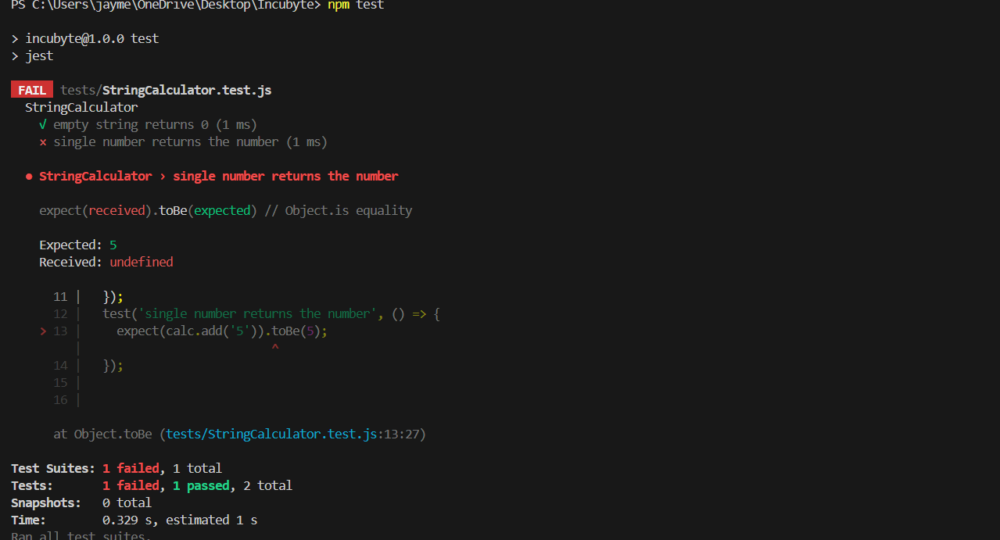       |
| 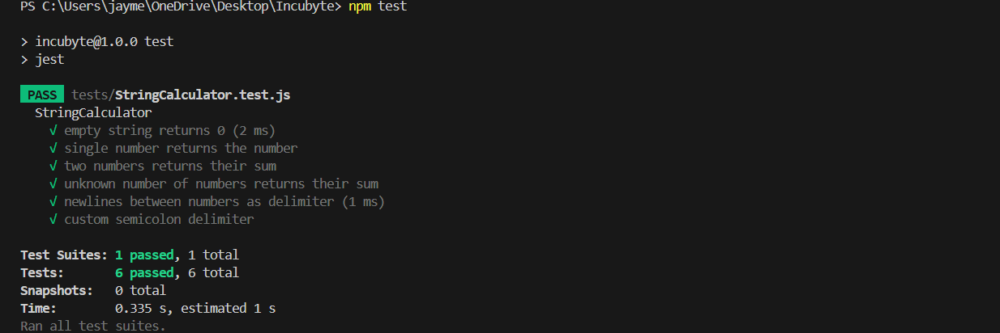    | 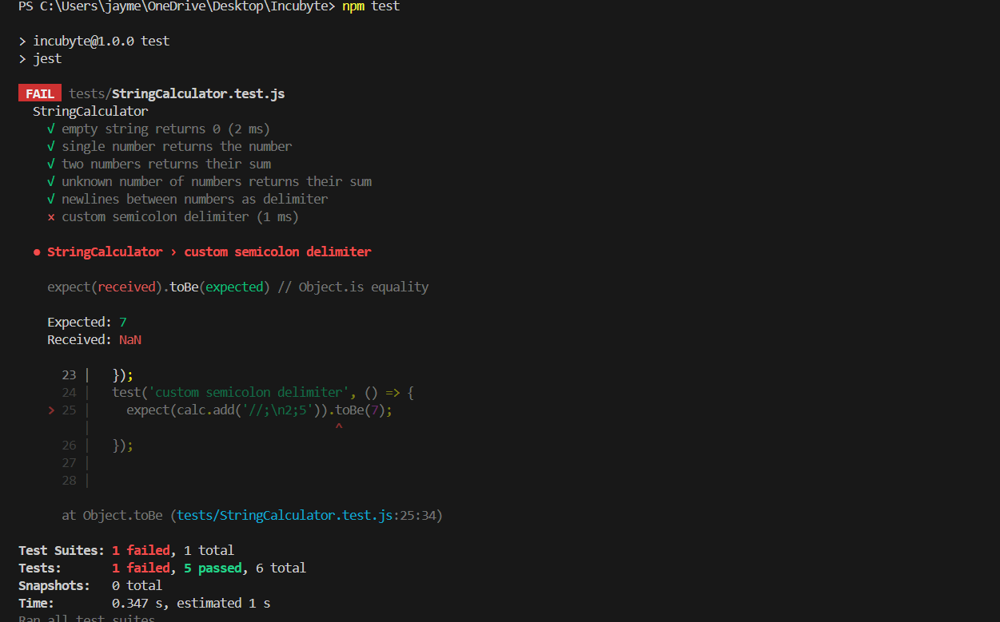    |
| 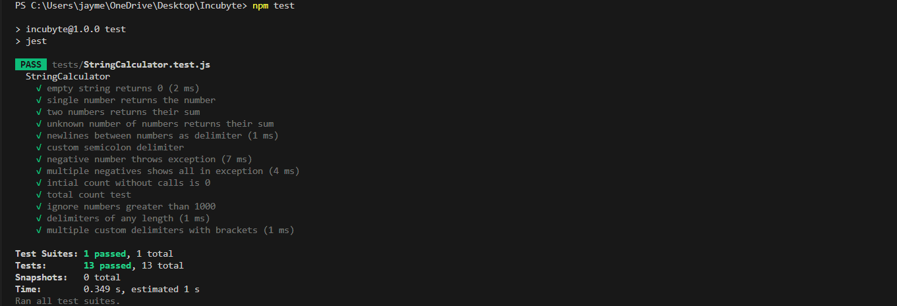  | 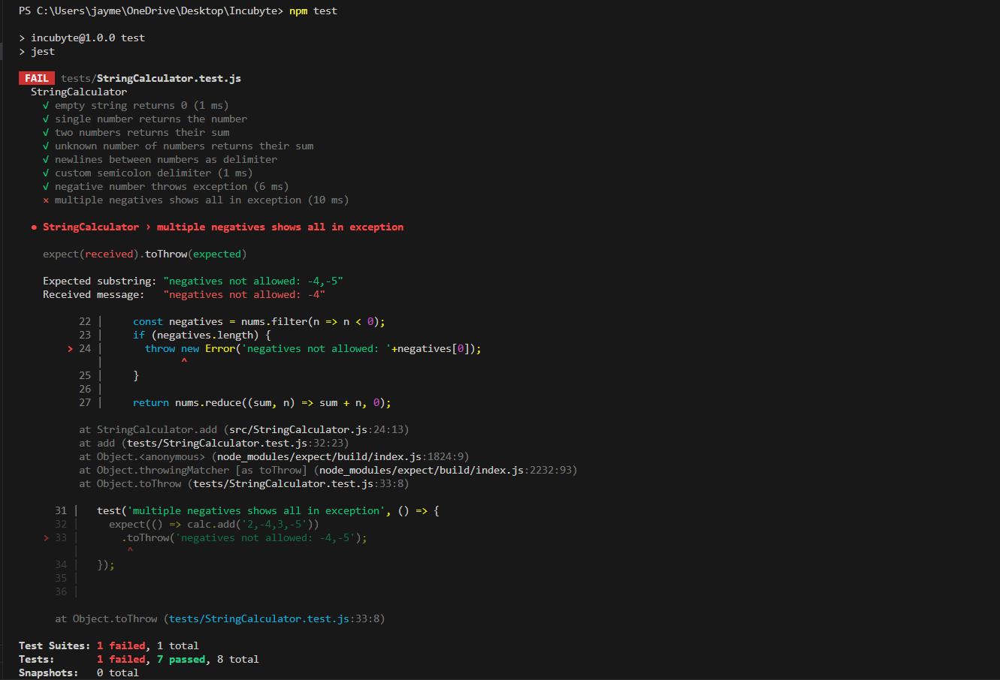 |
| 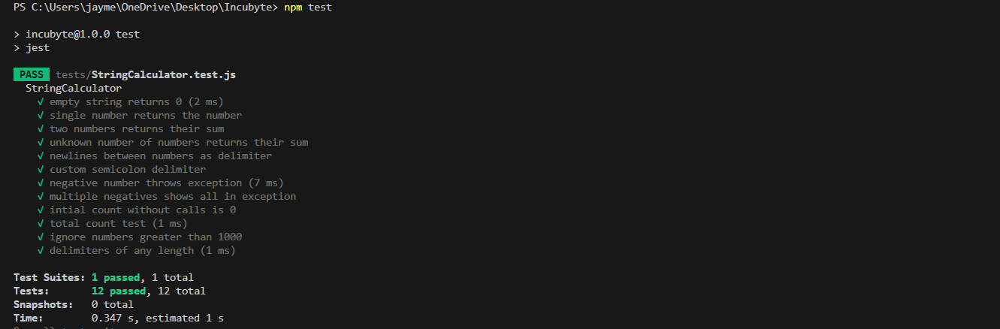 | 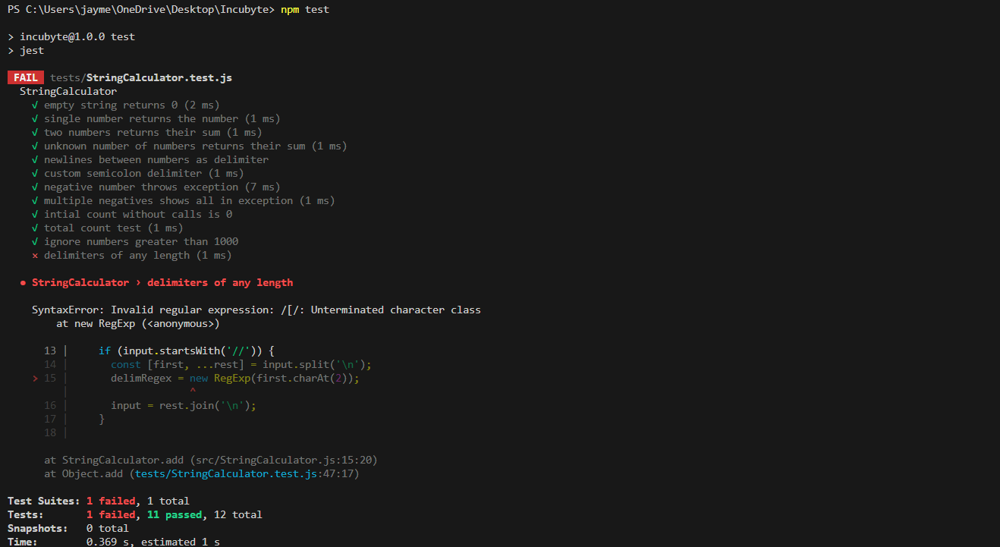 |
| 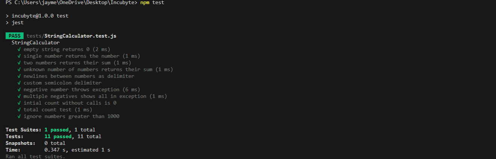 | 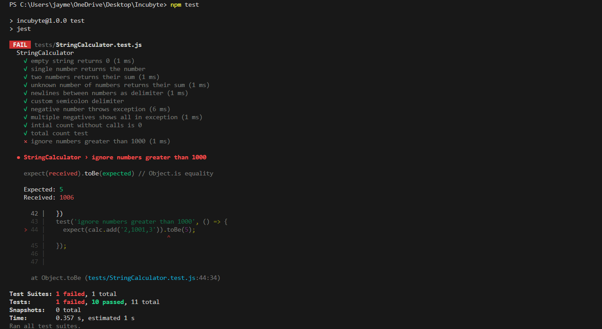 |
| 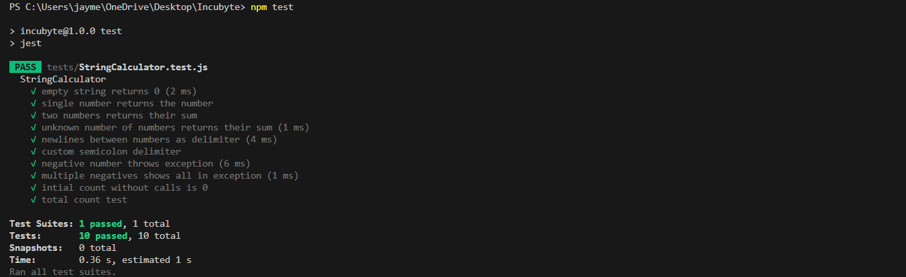          | 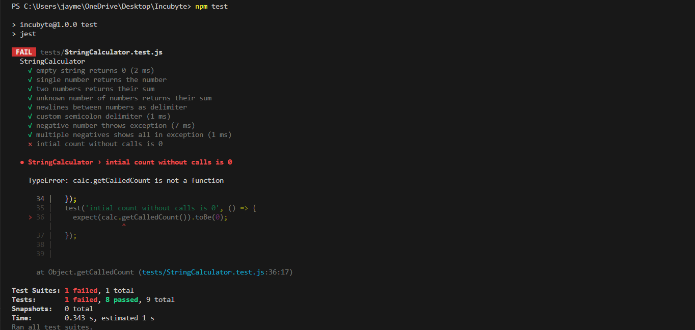          |
| 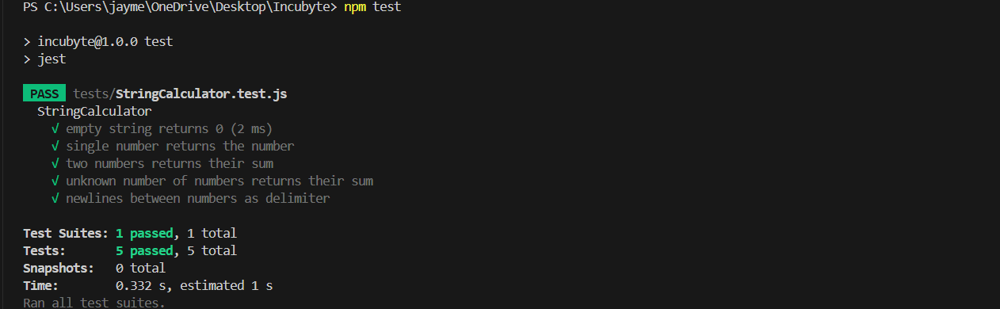   | 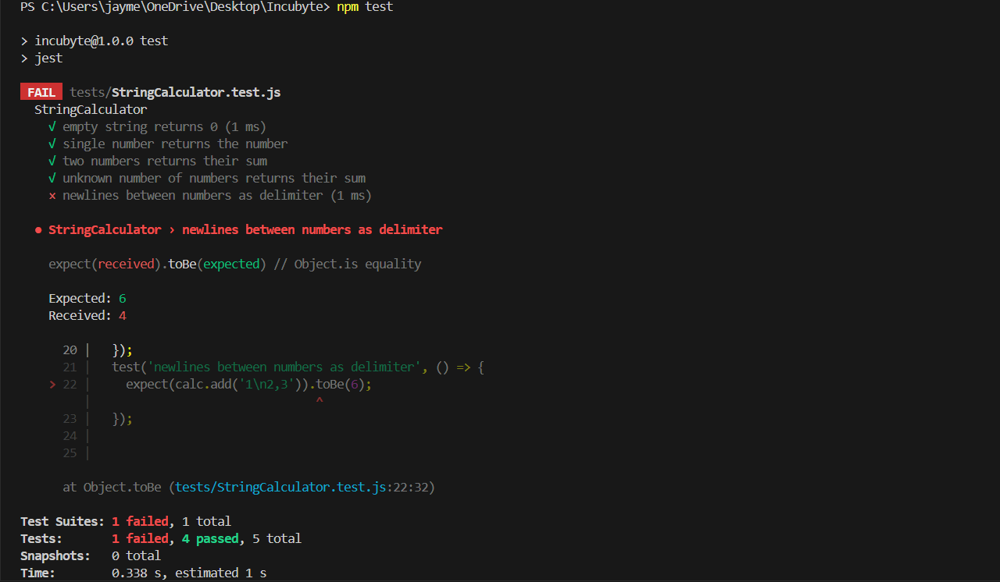   |

---


## 🛠️ Tech Stack

| Tool      | Purpose               |
|-----------|------------------------|
| JavaScript | Core language     |
| Node.js   | Runtime Environment    |
| Jest      | Testing Framework      |
| VS Code   | Code Editor            |
| Git       | Version Control        |

---

> 💡 _This project demonstrates clean architecture, thoughtful testing, and a modern JavaScript workflow suitable for real-world TDD assessments._

---

## 🧑‍💻 Author

Made by **Jay Mehta** – for the Incubyte Assessment
